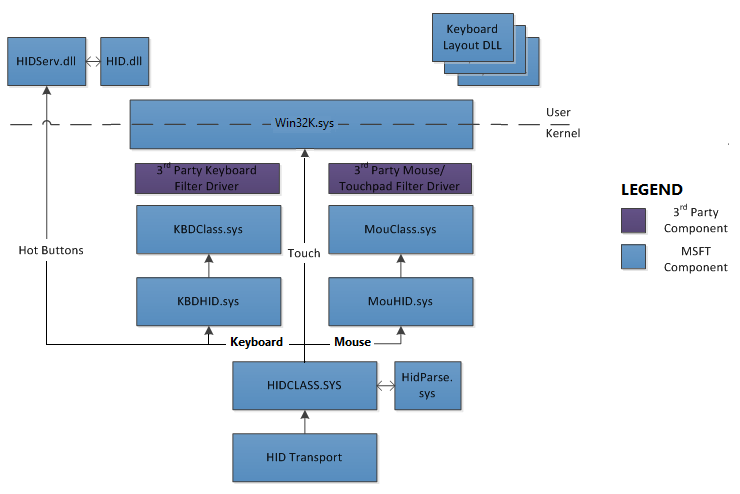

# WinAppleKey

Apple Magic Keyboard (A1644) driver for Windows 10. Note: this driver is not for the older A1314 model or any other models.

Feafures: 
- Swaps the Fn-Ctrl keys to align with standard Windows keyboard layouts (fearture not supported by Apple's Bootcamp driver).
- Maps the missing Windows keys such as the Del, Insert, Print Screen, Pause/Break, etc.

### Technical Details

WinAppleKey is implemented as a HIDCLASS LowerFilter WDM kernel mode driver. 



### Installation

**DISCLAIMER:** This driver is signed with a self-signed (test/development) certificate. For that reason, Windows will not allow the driver installation unless running in **TESTSIGNING** mode. Please be aware that permanently running Windows in **TESTSIGNING** mode leaves your system open to potential security risks. Any consequence because of this is solely your own responsibility. WinAppleKey is ***free software*** that you are willing to build and/or use completely ***at your own risk.*** If your system is running a UEFI BIOS with **Secure Boot** enabled, you will need to disable **Secure Boot** in BIOS first before enabling **TESTSIGNING** mode.

To switch to **TESTSIGNING** mode issue the following command (in an Administrative command prompt) and then reboot your PC: 

``` bcdedit.exe -set TESTSIGNING ON ```

You can now run the *Setup.msi* installer.

To uninstall, run the uninstaller from the ```Control Panel``` ```Programs``` and then manually revert TESTSIGNING mode by issuing the following command (in an Administrative command prompt):

``` bcdedit.exe -set TESTSIGNING OFF ```

### Key Mapppings

**WinAppleKey** creates the following key mappings:

  <table>
    <tr>
      <th>Input Key(s)</th>
      <th>Output Key</th>
    </tr>
    <tr>
      <td><kbd>LCtrl</kbd></td><td><kbd>Fn</kbd></td>
    </tr>
    <tr>
      <td><kbd>Fn</kbd></td><td><kbd>Left Ctrl</kbd></td>
    </tr>
    <tr>
      <td><kbd>⏏︎ Eject</kbd></td><td><kbd>Del</kbd></td>
    </tr>
    <tr>
      <td><kbd>⌘ Cmd</kbd></td><td><kbd>Alt</kbd></td>
    </tr>    
    <tr>
      <td><kbd>⌥ Alt</kbd></td><td><kbd>Cmd</kbd></td>
    </tr>       
    <tr>
      <td><kbd>Fn</kbd>+<kbd>[F1]</kbd>...<kbd>[F12]</kbd></td><td><kbd>[F13]</kbd>...<kbd>[F24]</kbd></td>
    </tr>
    <tr>
      <td><kbd>Fn</kbd>+<kbd>LCtrl</kbd></td><td><kbd>Right Ctrl</kbd></td>
    </tr>
    <tr>
      <td><kbd>Fn</kbd>+<kbd>Return</kbd></td><td><kbd>Insert</kbd></td>
    </tr>
    <tr>
      <td><kbd>Fn</kbd>+<kbd>P</kbd></td><td><kbd>Print Screen</kbd></td>
    </tr>
    <tr>
      <td><kbd>Fn</kbd>+<kbd>S</kbd></td><td><kbd>Scroll Lock</kbd></td>
    </tr>
    <tr>
      <td><kbd>Fn</kbd>+<kbd>B</kbd></td><td><kbd>Pause/Break</kbd></td>
    </tr>
    <tr>
      <td><kbd>Fn</kbd>+<kbd>&uarr;</kbd></td><td><kbd>Page Up</kbd></td>
    </tr>
    <tr>
      <td><kbd>Fn</kbd>+<kbd>&darr;</kbd></td><td><kbd>Page Down</kbd></td>
    </tr>
    <tr>
      <td><kbd>Fn</kbd>+<kbd>&larr;</kbd></td><td><kbd>Home</kbd></td>
    </tr>
    <tr>
      <td><kbd>Fn</kbd>+<kbd>&rarr;</kbd></td><td><kbd>End</kbd></td>
    </tr>
  </table>

**Multimedia Keys:**
The multimedia keys are not directly mapped as they correspond to F19-F24 instead but you can easily use this [AutoHotkey script](MapMultimediaKeys.ahk) for that purpose. Please note that this currently works only over the wired connection.

### Driver Settings

You can use regedit.exe to optionally modify certain driver settings.

To enable/disable the **Alt-Cmd key swapping** edit the DWORD key value: **HKEY_LOCAL_MACHINE\SYSTEM\CurrentControlSet\Services\WinAppleKey\SwapAltCmd**. The default value is 0 (off).

To enable/disable the **Fn-Ctrl key swapping** edit the DWORD key value:
**HKEY_LOCAL_MACHINE\SYSTEM\CurrentControlSet\Services\WinAppleKey\SwapFnCtrl**. The default value is 1 (on).

After changing any of these values, you will need to disconnect/connect your associated Apple keyboard(s) to trigger a driver reload, or alternatively reboot your machine.

### Build Instructions

To build the driver you will need **Visual Studio 2019** along with an installation of the 
  **Windows 10 Driver Kit (WDK)**. For the installer project, you will additionally need to install the **[WiX toolset](http://wixtoolset.org/)**. 

### Freequently Asked Questions

*Aiming to save you some time from sending me an e-mail* :)

#### 1. Will you ever release a full version (i.e. not self-signed) of the driver that does not require Windows running in TESTSIGNING mode?
Unfortunately I can't. This is due to Microsoft enforced restrictions. In order to fully release a device driver for Windows 10 (and later) you need to run a company (Ltd.) and also purchase a driver signing certificate for that company. Both cost a significant amount of money. WinAppleKey is free and open source and I do not make any money out of it. ***But*** there is similar free software for Apple keyboards, which does not require a driver installation. It uses a custom programmed Raspberry Pi Zero W device that functions as a special USB dongle for using Apple keyboards on Windows. More info [here](https://github.com/samartzidis/RaspiKey).

#### 2. How can I get the multimedia keys to work?

See paragraph **Multimedia Keys** above.

#### 3. When running in the default fn-ctrl swap mode, the ctrl-lshift-t combination commonly used to reopen a closed browser tab in Chrome does not work.

This is an issue of the Apple keyboard hardware rather than the driver. You can use the ctrl-rshift-t combination instead.

#### 4. I am trying to enable Test Signing mode but I get this error: ```The value is protected by Secure Boot policy and cannot be modified or deleted```.

You will need to disable Windows **Secure Boot**, please read the *Disclaimer* part.

### Donate

[](https://www.paypal.com/cgi-bin/webscr?cmd=_s-xclick&hosted_button_id=TBM5P9X6GZRCL)
<br/>
**Bitcoin:** bc1qecklcec0z2hzv7twf97p2tr44syw5z5aqmamrt


